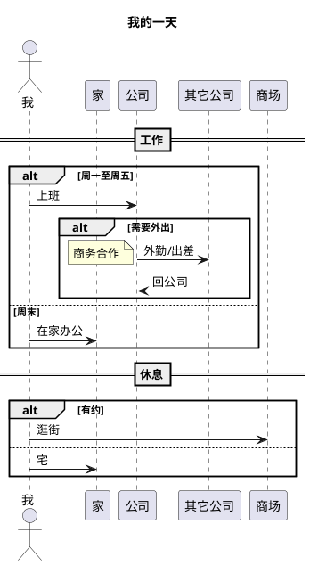

```plantuml
@startuml
title 我的一天
actor 我 as me
participant 家 as homne
participant 公司 as company
participant 其它公司 as ocompany
participant 商场 as market
==工作==
alt 周一至周五
me -> company:上班
alt 需要外出
company -> ocompany:外勤/出差
note left: 商务合作
ocompany --> company:回公司
end
else 周末
me -> homne:在家办公
end
==休息==
alt 有约
me -> market:逛街
else
me -> homne:宅
end
@enduml
```